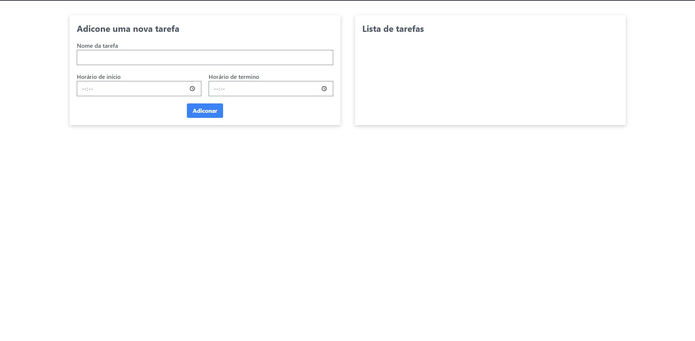
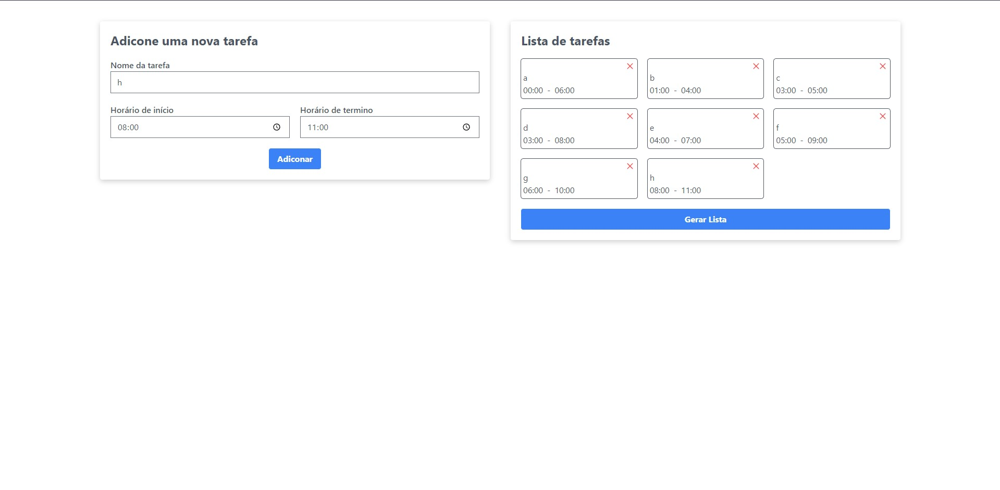
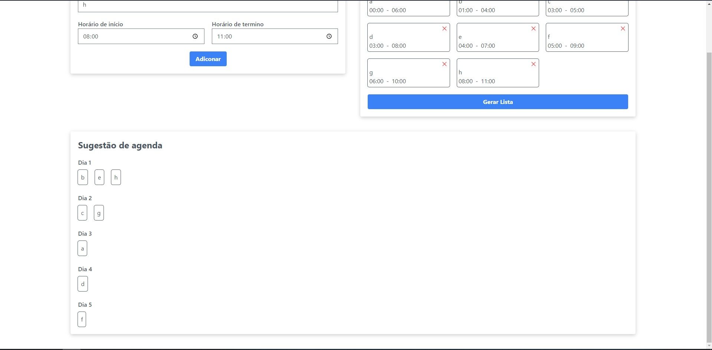

# Interval-Scheduling

**Número da Lista**: X<br>
**Conteúdo da Disciplina**: Greed<br>

## Alunos

| Matrícula  | Aluno                      |
| ---------- | -------------------------- |
| 19/0015721 | Júlio César Martins França |

## Sobre

O objetivo principal do projeto é utilizar o algoritmo Interval Scheduling para sugerir uma agenda de acordo com as tarefas adicionadas pelo usuário.

## Screenshots





## Vídeo de apresentação

<div style="position: relative; padding-bottom: 56.25%; height: 0;"><iframe src="https://www.loom.com/embed/b62f1a02ae2c4fc9b5f143804e856a11" frameborder="0" webkitallowfullscreen mozallowfullscreen allowfullscreen style="position: absolute; top: 0; left: 0; width: 100%; height: 100%;"></iframe></div>

## Instalação

**Linguagem**: JavaScript<br>
**Framework**: Next.js<br>

### Pré-requisitos

- Ter o [Node.js](https://nodejs.org/en) instalado
- Foi utilizada a v18.16.0 nesse projeto

### Como rodar o projeto

Depois de clonar o repositório:

- Entrar no diretório "task-scheduling"

```
cd task-scheduling/
```

- Instalar as dependências

```
npm install
```

- Rodar o projeto

```
npm run dev
```

O projeto será aberto no link http://localhost:3000/

## Uso

- Após adicionar pelo menos uma tarefa aparecerá o botão GERAR AGENDA
- Clique em GERAR AGENDA para visualizar as tarefas que não possuem conflito de horário
